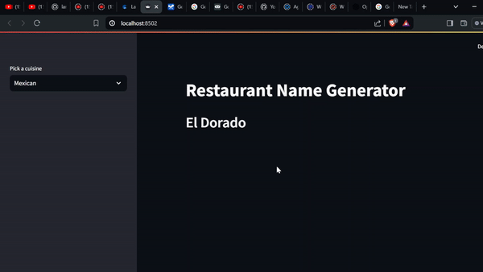

# Build a Langchain Restaurant Name Generator with GoogleAI

 

Langchain is a language model integration and orchestration framework that allows you to build powerful chatbots and other AI applications. It is a centralized development environment for building large language and multimodal model software applications, which can then be integrated with data sources and software workflow. It supports indexes in vector databases for retrieval and embedding of data, chains for sequential flow of prompt output, memory to store output history, and prompt template to create a template for your application prompt.

This article explains how to build a GenAI application using Langchain GoogleAI Large Language Model (LLM) to create a prompt template to generate an Indian, Italian, and Mexican restaurant name. 



## Prerequisite 
Before you begin, ensure you:
* Install Python 
* Signup to GoogleAI account : https://aistudio.google.com/


## Preparing the Environment

To run the restaurant name generator app, install Langchain and GoogleAI environment packages. Follow the steps below to set up your application environment.

Install pipenv to manage the package dependencies of your application.
    
```console
pip install pipenv
```

Install the Langchain and GoogleGenerativeAI model packages.

```console
pipenv install langchain-google-genai langchain_core langchain
```

Create a new GoogleAI API key as follows:

* Go to https://aistudio.google.com/app/apikey
* Create a key and copy it

Create a `.env` file, edit and save the API key.

```console
api_key = "AIzaSyCJBmdqxxxxxxxxxxxxxxxxxxxxx"
```

> [!NOTE]
>
> Replace the `AIzaSyCJBmdqxxxxxxxxxxxxxxxxxxxxx` with your GoogleAI API key.
> 


Create a `.gitignore` file, edit and add `.env` to ensure the `.env` file with the API key does not commit.

```console
echo ".env" >> .gitignore
```


## Set up the Restaurant Name Generator Application

Content still in the oven. PLEASE CHECK BACK SOON!